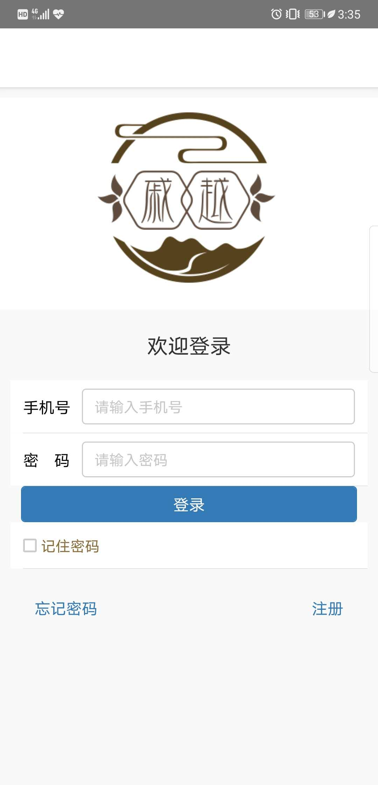
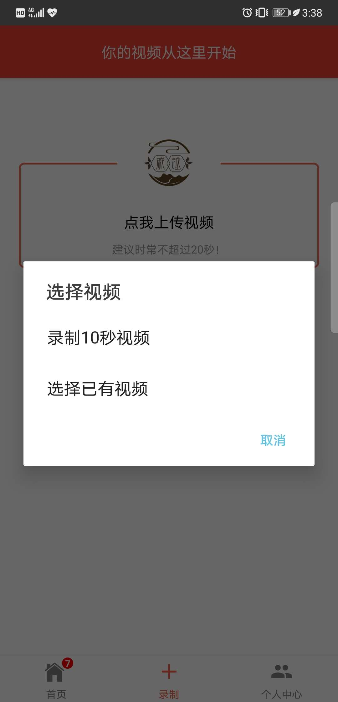
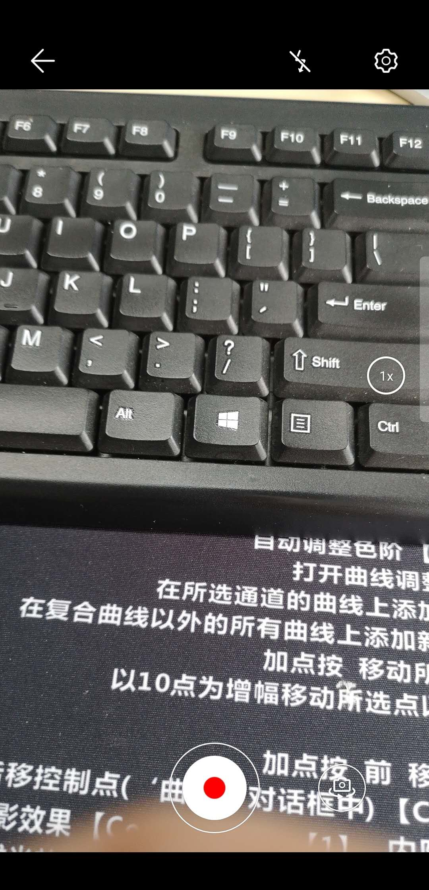
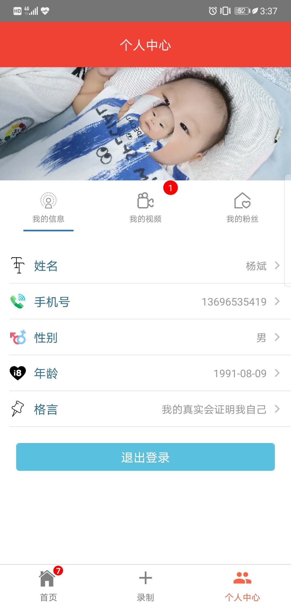
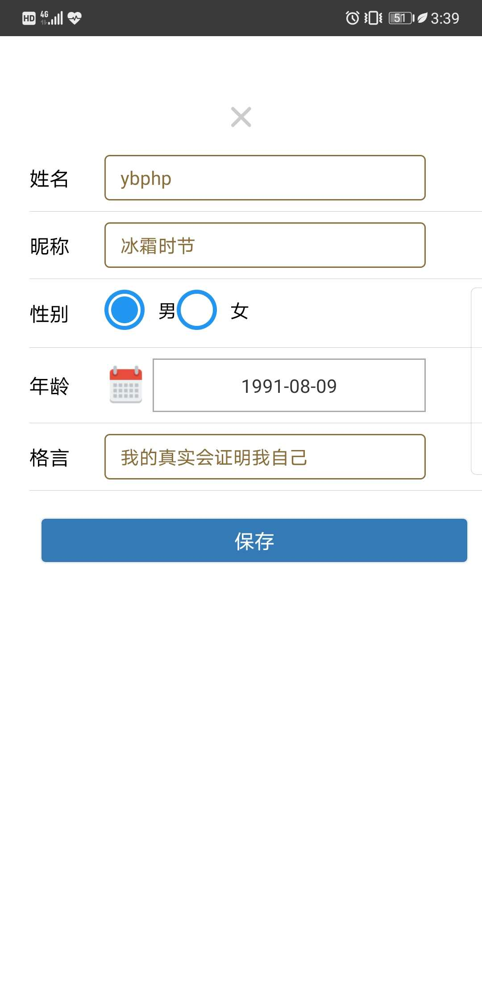

# React-Native
基于React Native 0.59版本开发的短视频APP,记录陪娃的那段时光。

### 登录
* 加入了缓存令牌机制，有效期一周。

### 首页（视频列表）
* 可以点击收藏，然后在个人中心我的收藏里面查看到。

### 视频播放页面
* 有控制视频的播放暂停，进度条，可以评论。

### 录制视频
* 选择本地视频或者自己录制10s视频，上传后会存储到七牛云，进行视频转码。

### 个人中心
* 选择本地视频或者自己录制10s视频，上传后会存储到七牛云，进行视频转码。

